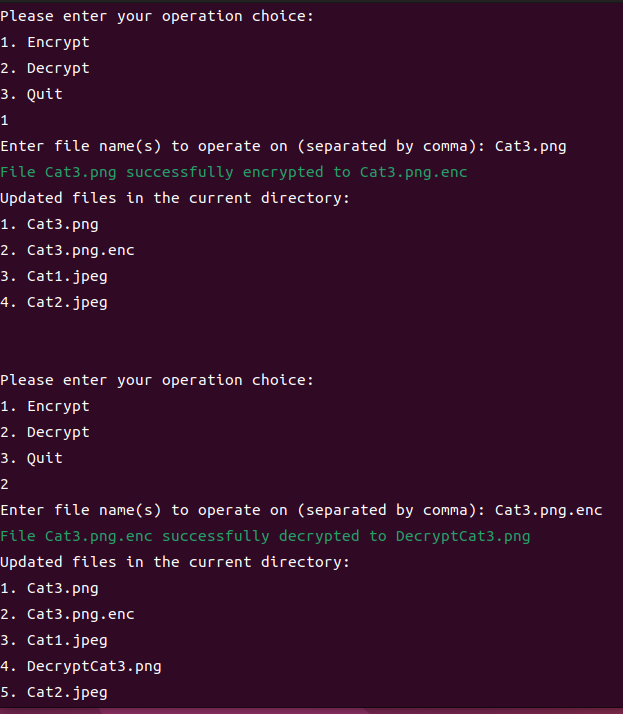
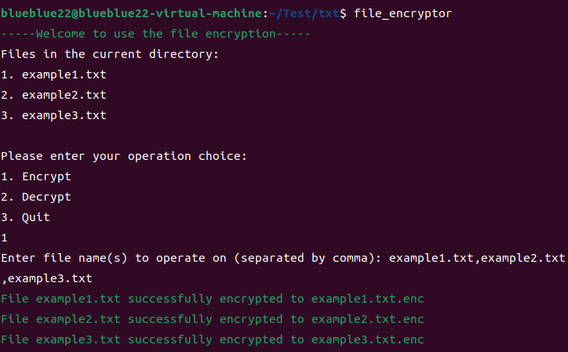
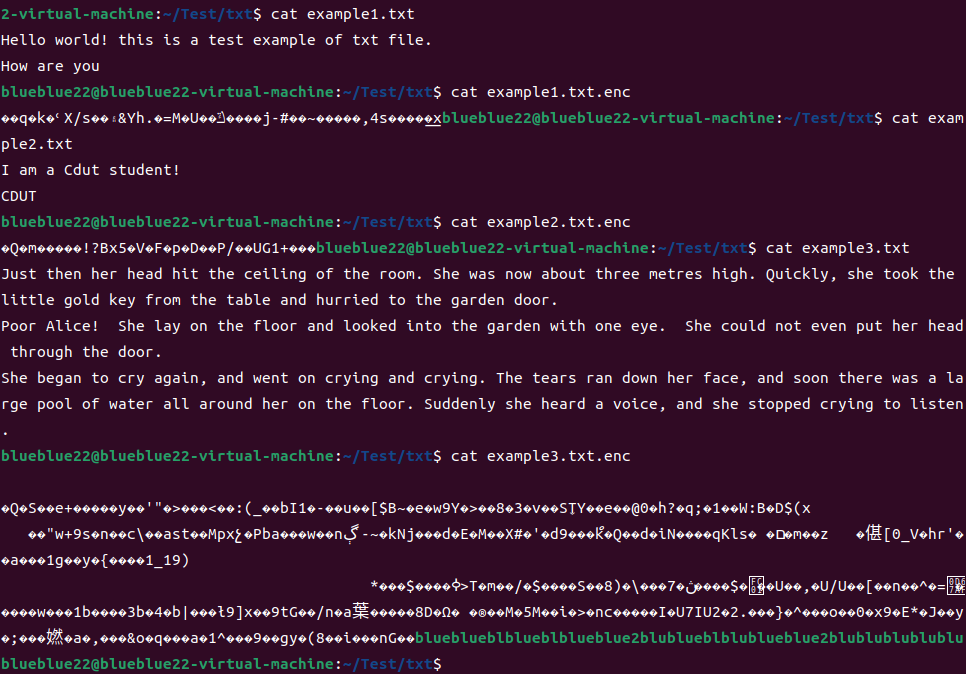

#  Overview
The **AES** algorithm is implemented and integrated into the file system based on the **Ubuntu** operating system. Users in this system can encrypt and decrypt files using this method.  

## Function: 
1. File encryption  
2. File decryption  
3. Multi-processing   
4. Error handle  

## Test Result  
Test case 1:   
  
result 1:  
  

---

Test case2:   
  
result2:  
  
 

